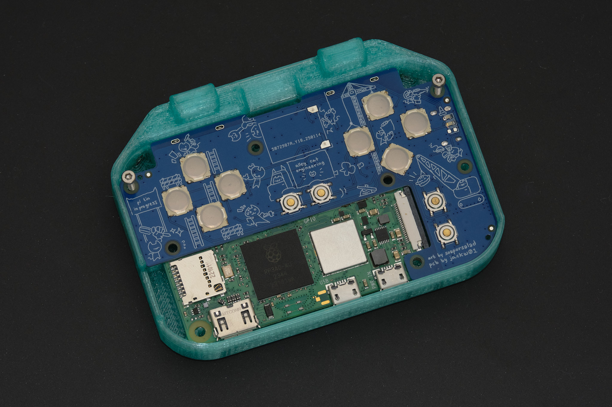
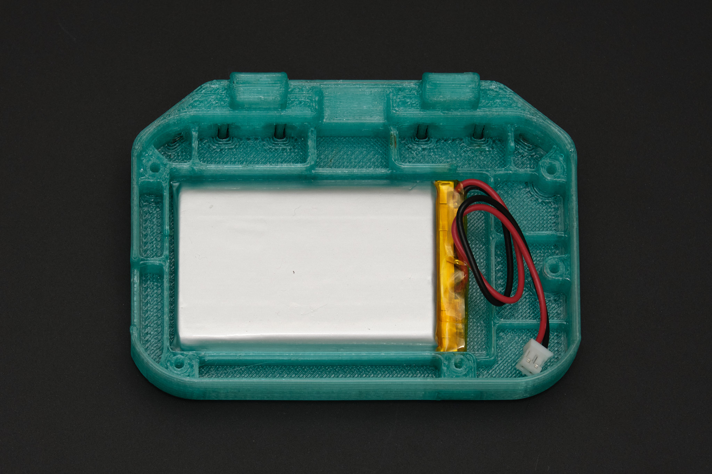
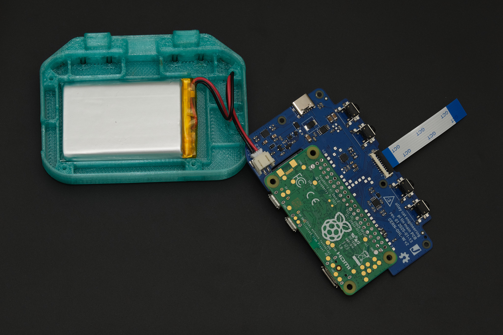
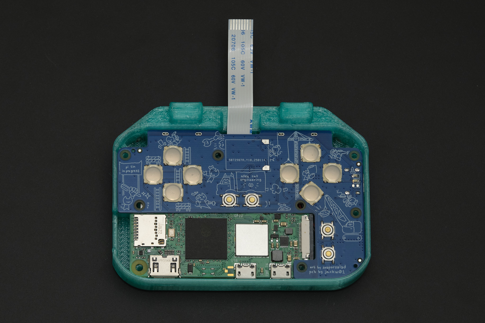
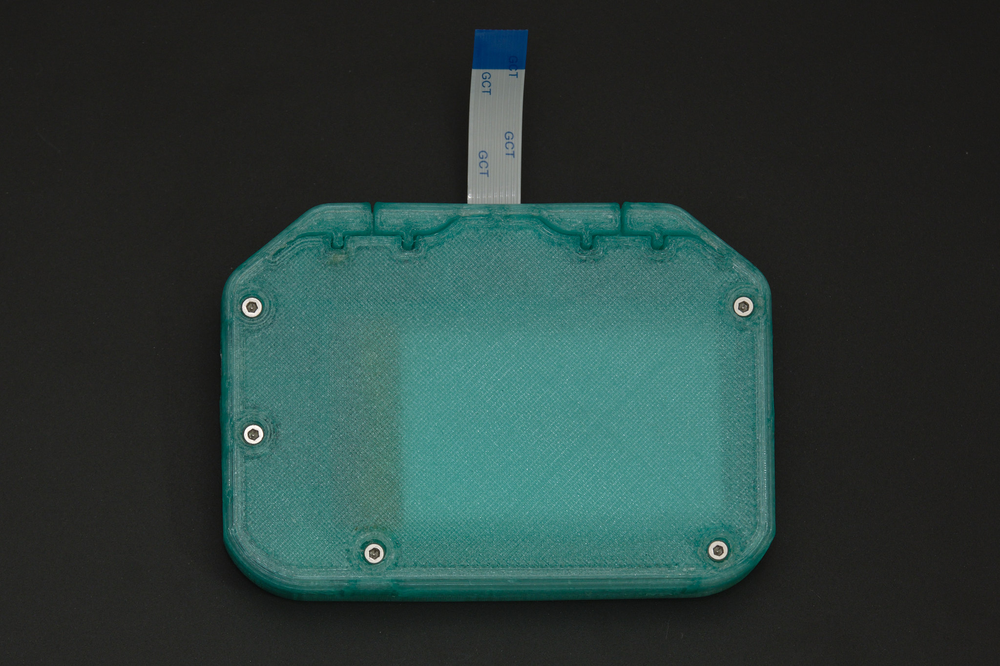
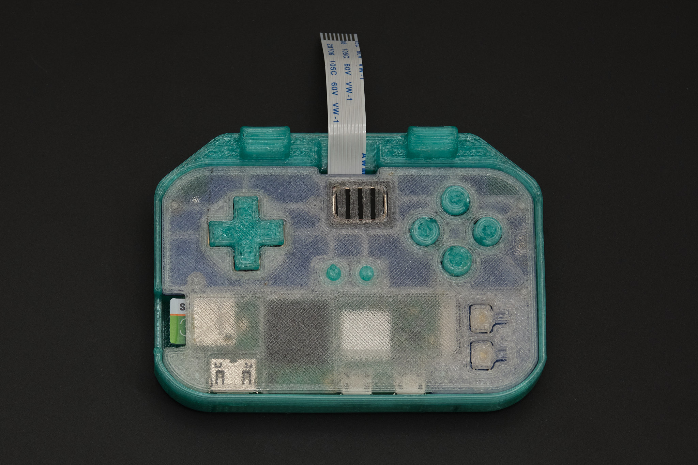
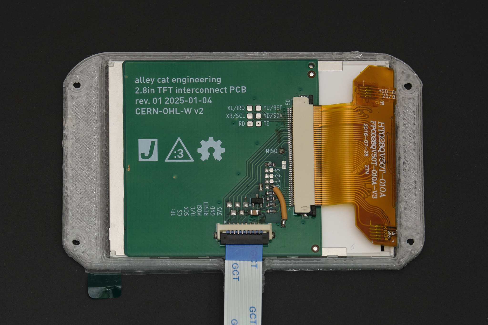
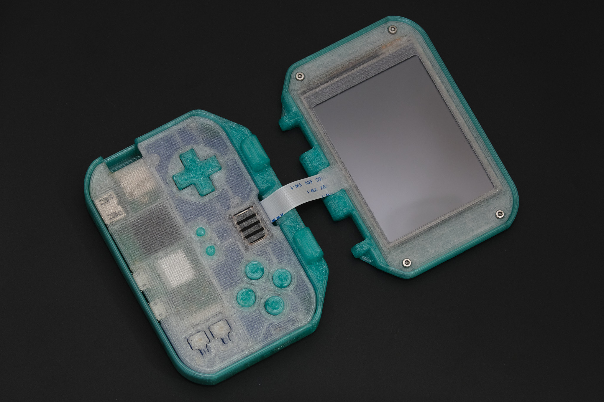
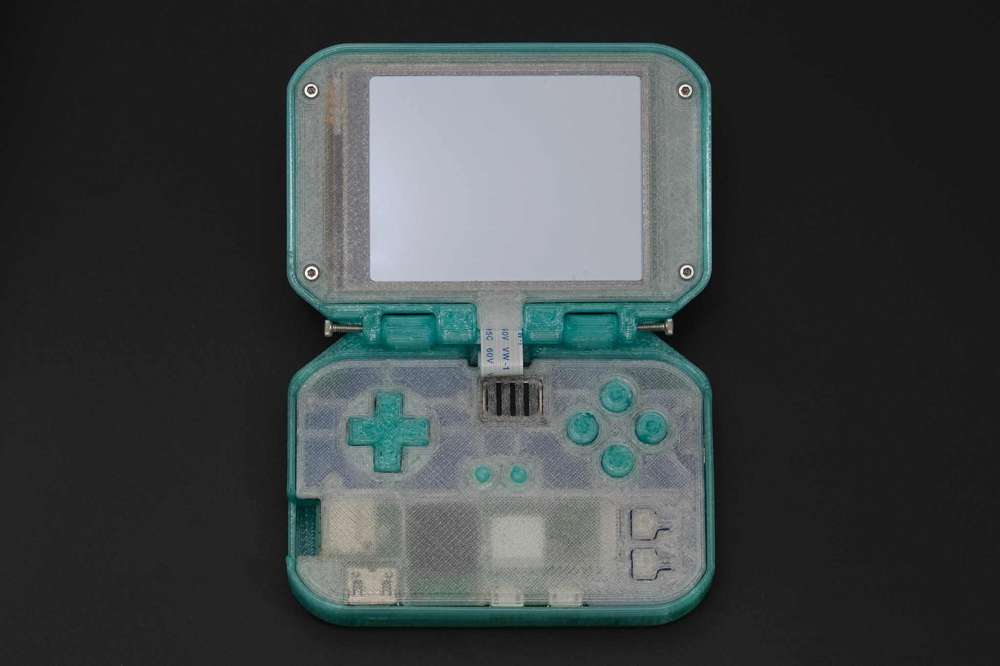
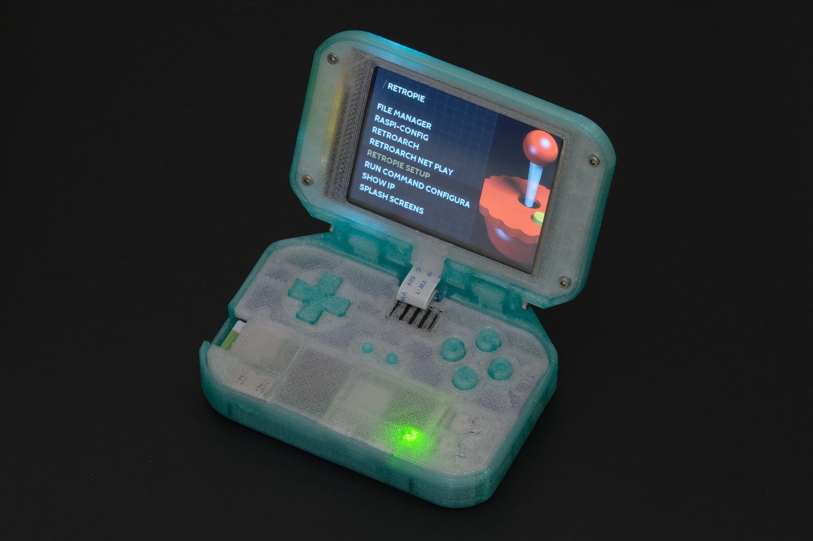

# Final Assembly (3D Printed Version)

## 1. test fit the PCB

Insert the Main PCB assembly into the lower case and loosely insert M2x12 socket head cap screws into the two uppermost screw holes to align the PCB with the case. Verify that all four of the rear buttons can be clicked. If they stick or require excessive force, it is likely because of stringing or blobs of plastic inside the narrow cuts the form the buttons in the 3D printed part. Use fine point tweezers, a craft knife, or dental floss to clear the obstructions.

*Note: If one of the buttons still gets stuck, it may be due to poor alignment of the Main PCB and Raspberry Pi putting pressure on the tactile switch. In this case, try shimming the PCB by inserting a small piece of paper or tape between the edge of the PCB near the button and the lower case in the next step.*

## 2. lower case assembly

Remove the PCB and screws and insert the battery into the lower case with the wires facing to the right. Coil the wires as shown and connect the battery to the Main PCB. Disconnect the display cable from the Display PCB (lift the black retention flap on the connector, then remove the cable) and connect it to the Main PCB.

Insert the Main PCB assembly into the lower case. The battery wires should stay in the space to the right of the battery and should not be pinched between the PCB and case or battery.

The Main PCB assembly should ideally fit snugly inside the lower case. If it is loose, plug a USB-C cable into the connector to help with the next step. Turn the lower case assembly upside down and place it onto the assembled front panel. While holding the lower case and front panel together, insert the five M2x12 socket head cap screws into the bottom side of the case and tighten them in a star pattern.

Check that the buttons on the front panel are not sticking. If they are, it is likely due to misalignment of the 3D printed membrane or defects on the 3D printed parts that need to be trimmed off.

## 3. display assembly

Fold the display FPC over the back of the display and place the display assembly into the display bezel, oriented so that the display cable connector is aligned with the tab on the bezel. Connect the display cable to the Display PCB.

Place the display housing over the display bezel so that the display cable is aligned with the cutout in the housing. Flip the assembly over and insert the four M2x4 socket head cap screws into the display bezel. Tighten the screws in a star pattern.

## 4. final assembly

Line up the display housing with the mounting points on the lower case. Insert and tighten the two M2x20 socket head cap screws.

Finished?
