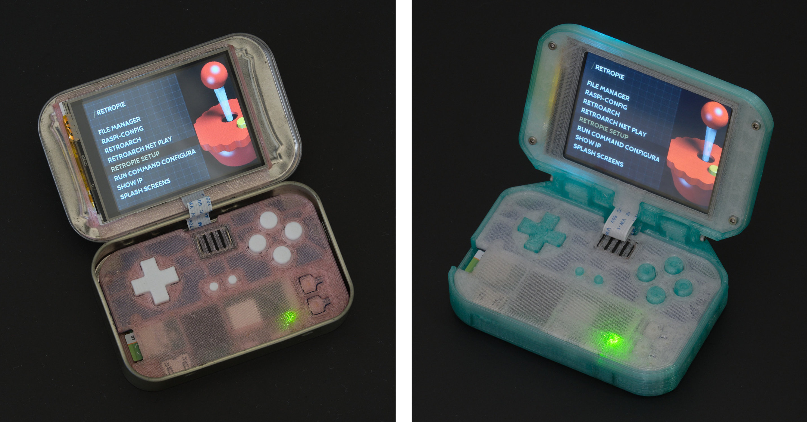
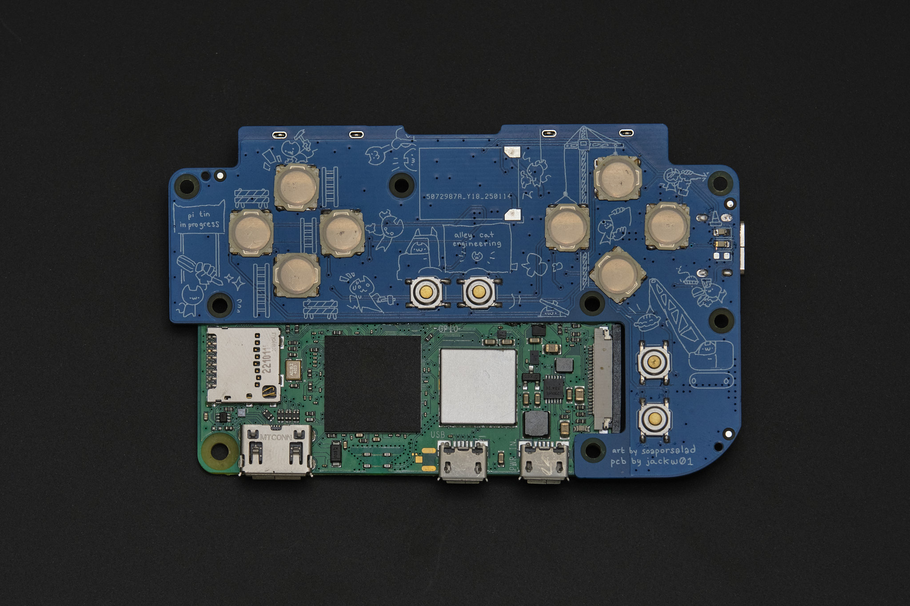
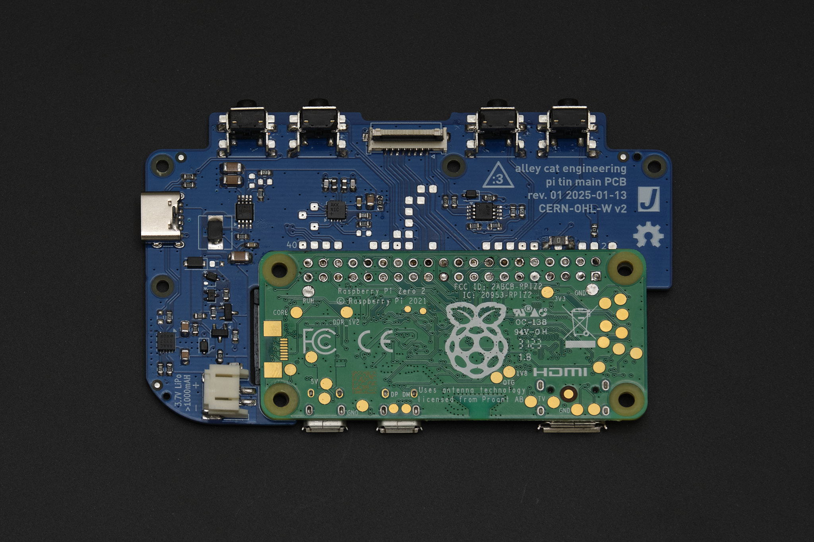
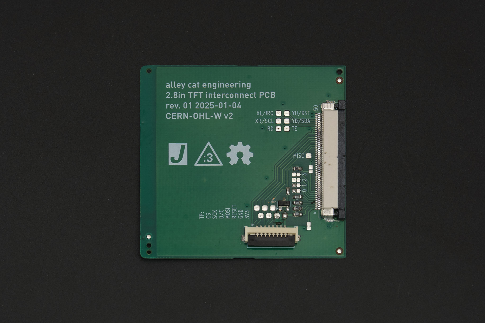
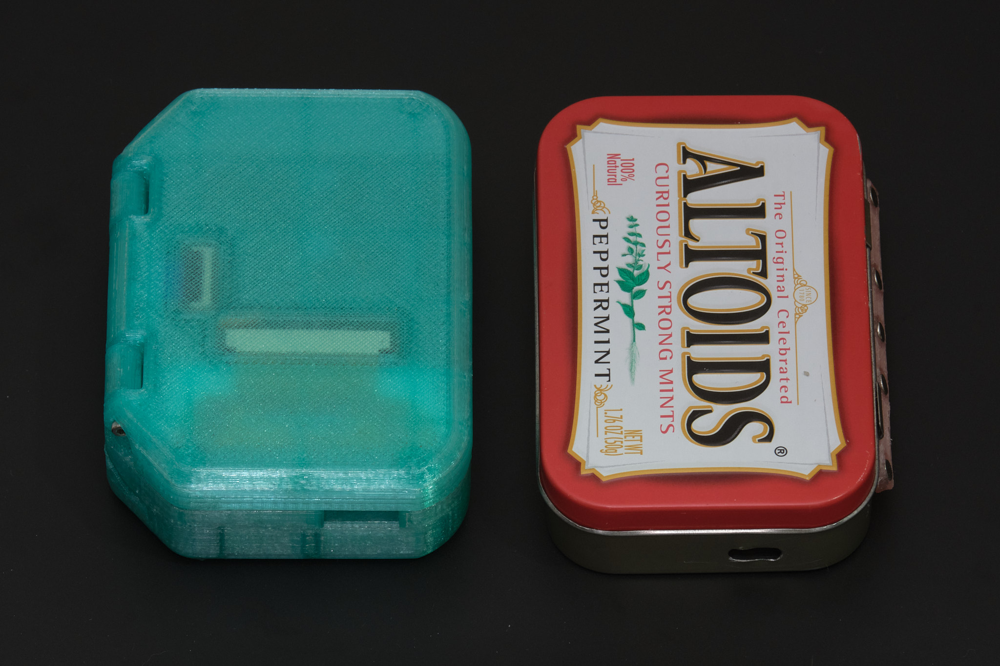
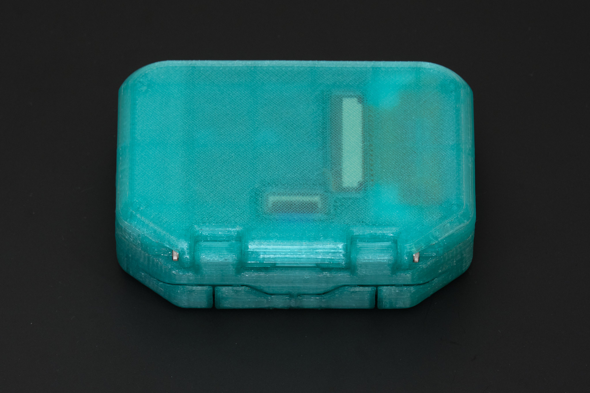
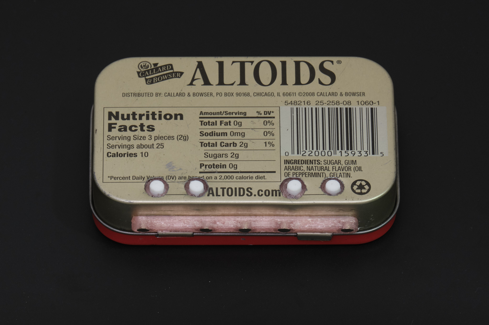

# Pi Tin - the open source Raspberry Pi handheld retro gaming console

Pi Tin is an open source retro gaming device designed around the Raspberry Pi Zero 2 W and a 2.8" 320x240 TFT display, the largest readily available size that will fit into an Altoids tin. The Pi Zero 2 W is capable of emulating most SNES, GBA, PS1, Genesis/Megadrive, and even some N64 games.

Pi Tin's gamepad uses the exact same Alps tactile switches and elastomer membrane design used in the Gameboy Advance SP and DSi to achieve superior button feel over designs using conductive rubber buttons or bare tactile switches. It features a soft power button to turn on or safely shut down the system with a single press, and is designed to be safe to use while charging and compatible with all USB-C cables and chargers. The battery lasts for up to 5 hours of gaming <small>(tested on 3D printed case option - 2000mAh battery)</small>.

Building a Pi Tin requires a Raspberry Pi Zero 2 W, two custom PCBs, some 3D printed parts, and a few other components which are readily available from distributors. The PCBs can be manufactured by low-cost manufacturers like JLCPCB, but they require advanced soldering skills and ideally both a hot plate and hot air station to assemble by hand. We are working on making kits with assembled PCBs available to purchase.

[Schematic as PDF (Rev. 2)](pcb/pcb_main_r2/pi_tin_main_pcb_r2.pdf)

[Schematic as PDF (Rev. 2)](pcb/pcb_display_r2/pi_tin_display_pcb_r2.pdf)

*Note: Rev. 1 PCBs shown, Rev. 2 PCBs have minor differences.*

## build options

Pi Tin can either be built with a 3D printed clamshell case (93 x 66 x 26.5mm) or built to fit inside an Altoids tin.

The Altoids tin build option is more difficult than the 3D printed case option; it requires additional tools and experience using them. It has poor ergonomics due to the constraints of building inside an Altoids tin and the battery capacity is 40% lower than the 3D printed case version. We strongly recommend the 3D printed case option for these reasons.

**Important: Read through all the instructions thoroughly before building. This is an intermediate level project and we don't recommend attempting it without prior electronics kit building experience.**

Build instructions for both options start with the [hardware build guide](./hardware_build).

## license

The PCB schematics, layouts, and Gerber files and the 3D CAD files for this project are released under the CERN Open Hardware Licence Version 2 - Weakly Reciprocal (CERN-OHL-W V2). The files in the `software` directory are in the public domain, free of copyright restrictions. The text, photographs, and illustrations on this website may not be reproduced without permission.

## legal disclaimer

Any trademarked product names found on this website belong to their respective owners; this project is in no way affiliated with or endorsed by these companies. Pi Tin is designed to run [RetroPie](https://retropie.org.uk/), which is open source software released under the GPL. The prebuilt RetroPie disk image we provide does not contain any copyrighted ROMs or games. Pi Tin is not designed to enable illegal activity; we do not condone piracy and we will not provide support to anyone looking to obtain copyrighted content. Posting requests for copyrighted ROMs or other piracy-related content on GitHub issues or discussions will result in deletion and a ban.
