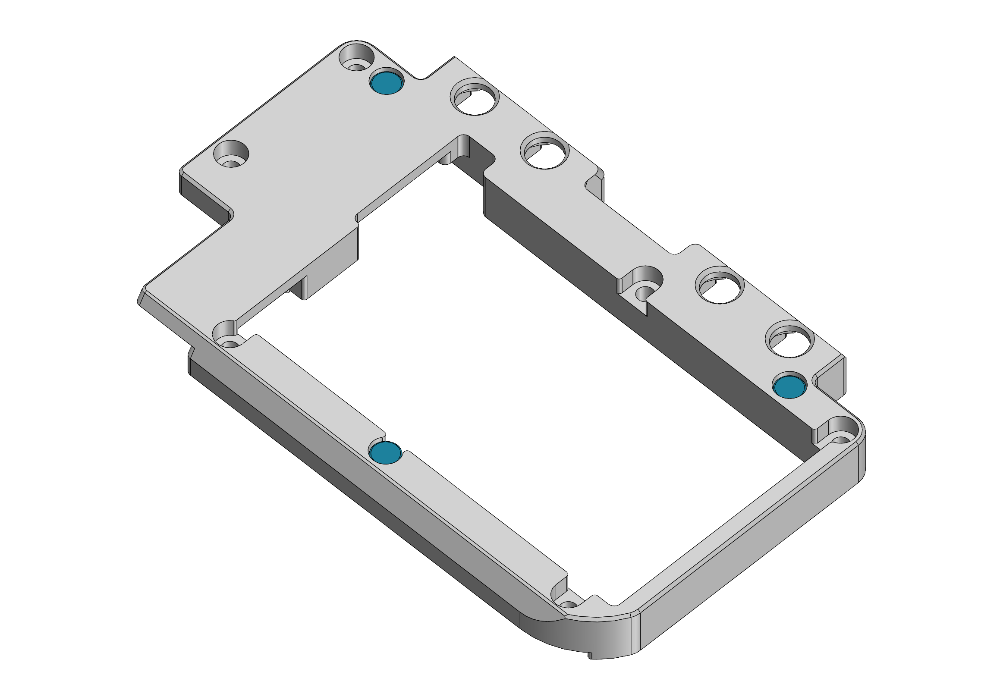

# Final Assembly (Altoids Tin Version)

**Important: Clean surfaces with isopropyl alcohol before using glue or double-sided tape.**

## 1. complete the Main PCB package

Insert three 4x2mm neodymium disc magnets into the rear housing as shown, applying a small dab of cyanoacrylate glue to hold each one in place.

Place the Main PCB onto the assembled front panel and connect the battery, leaving a loop in the battery wires.

Insert the four rear buttons into the rear housing, then pick up the front panel and Main PCB together and mate them with the rear housing. The components should fit together without any force and the battery wires should not be pinched between the rear housing and PCB. Insert six M2x8mm socket head cap screws into the counterbore holes on the rear housing and tighten them in a star pattern. Do not overtighten the screws - stop tightening as soon as no gap is visible between the 3D printed parts and the PCB. Some downward pressure is required when tightening the screws for the first time since they are threading directly into plastic.

## 2. prepare the Altoids tin

Align the drill guide with the tin as shown and use it to mark locations for drilling holes for the USB port and rear buttons. Mark the center of the holes using a center punch or scribe. Use caution if using an automatic center punch as it will leave large dents in the tin if nothing is placed on the other side of the thin metal.

Drill all holes with a 1/8in (3mm) drill bit. Drill out the four rear button holes to 3/16in (5mm), using a sacrificial piece of wood on the other side of the tin to keep the metal from tearing. Use flush wire cutters to cut out the remaining tab of metal between the holes forming the USB port cutout. Using needle files, file the USB port cutout to its final shape and debur the edges of the other holes.

Thoroughly clean the tin to remove any metal shavings.

## 3. install the lid holder

Insert five 4x2mm neodymium disc magnets into the holes in the lid holder, applying a small dab of cyanoacrylate glue to hold each one in place.

Attach the lid holder to the tin as shown using cyanoacrylate glue. The magnets should all come into close contact with the lid when the tin is opened.

## 4. display

Use thin double-sided tape to attach the Display PCB to the rear of the display. The Display PCB is positioned correctly when the display FPC is in its natural resting position - the FPC should not be pulled taut or have excessive slack. The Display PCB should not overhang the edges of the display module and the display interconnect cable should be centered with the viewing area of the display.

Apply thin double-sided tape to the top of the Display PCB and the exposed corners of the rear of the display module. Attach the display mount as shown, ensuring that the entire LCD module is inside of the rectangle defined by the two flanges on either side of the display mount. Any vertical misalignment may result in the LCD getting damaged when the tin is closed.

Apply thin double-sided tape to the display mount. Attach it to the inside of the Altoids tin lid so that the display cable is horizontally centered within the tin.

**Note: When installed correctly, the display module will appear off center. This is intentional and the viewing area of the display will be centered as shown below.**

## 5. final assembly

Connect the display cable to the Main PCB following the same steps used to connect it to the Display PCB. Insert the Main PCB package into the Altoids tin. It is easiest to insert the bottom edge (Raspberry Pi side) first at an angle and then tilt the assembly into place. Check that the rear buttons and USB port line up and that the Main PCB package is sitting flush with the base of the tin. Check that the tin is still able to close, making sure that the display cable folds into the space between the front panel and the display instead of being pinched between the display and the tin.

If everything appears to work mechanically, head over to the [software setup guide](./software_setup) to install RetroPie on the Raspberry Pi.
