# Pi Tin Hardware

**Important: Read through all the instructions thoroughly before building. This includes the software setup guide and the final assembly instructions for your chosen build option.**

## required parts

- Raspberry Pi Zero 2 W (Pi Zero 1 not tested, and will probably not work)
- Pi Tin Main PCB
- Pi Tin Display Interconnect PCB
- 2.8" ILI9341 TFT display with 50-pin FPC connector ([Adafruit 1774](https://www.adafruit.com/product/1774))
- Micro SD card, 8GB or larger
- speaker ([CUI CMS-151125-076S-67](https://www.digikey.com/en/products/detail/same-sky-formerly-cui-devices/CMS-151125-076S-67/9561097))
- display interconnect cable ([GCT 10-08-A-0050-C-4-08-4-T](https://www.digikey.com/en/products/detail/gct/10-08-A-0050-C-4-08-4-T/22247571))
- 3D printed faceplate
- D-pad, A/B/X/Y, start, and select buttons (either 3D printed or DS Lite buttons)
- 3D printed TPU button inserts/membranes (exact parts needed depend on buttons used)

### for 3D printed case version

- 2000mAH LiPo battery, 8.0x38x60mm ([Adafruit 2011](https://www.adafruit.com/product/2011))
- 5x M2x12 socket head cap screw
- 4x M2x4 socket head cap screw
- 2x M2x20 socket head cap screw
- 3D printed lower case
- 3D printed display housing
- 3D printed display bezel

### for Altoids tin version

- 1200mAH LiPo battery, 5.0x35x62mm ([Adafruit 258](https://www.adafruit.com/product/258))
- Altoids Classic 1.76oz tin (other brands or sizes will not work)
- 6x M2x8 socket head cap screw
- 4x 4x2mm neodymium disc magnets
- 3D printed rear housing
- 3D printed display mount
- 3D printed lid stop
- 3D printed lid clip
- 4x 3D printed rear button
- 3D printed drill guide

## required tools and materials

- soldering iron with narrow conical tip
- solder (63% tin / 37% lead solder, 0.6mm or smaller diameter recommended)
- 2mm thick x 10mm wide EPDM foam tape or similar adhesive-backed foam (included in kits)
- flux pen or paste flux (use rosin or no-clean flux only, not water soluble flux. we recommend [Chip Quik NC191](https://www.digikey.com/en/products/detail/chip-quik-inc/NC191/11480391))
- two binder clips or small spring clamps (such as [Harbor Freight #69375](https://www.harborfreight.com/micro-spring-clamp-set-6-piece-69375.html))
- multimeter with continuity test setting
- 1.5mm hex screwdriver or allen key
- fine point tweezers
- computer with Micro SD card reader

### for Altoids tin version

- drill with 1/16in (1.5mm), 1/8in (3mm), and 3/16in (5mm) drill bits
- needle files, or rotary tool with small abrasive grinding bits
- small flush wire cutters
- wood block that fits inside open Altoids tin, to support it during drilling
- isopropyl alcohol, 91%
- thin double-sided tape (such as 3M 468MP or Tesa 61395)
- cyanoacrylate adhesive (super glue)

## 3D printing instructions

*Note 2025-06-07: STL files have been updated with some minor changes for manufacturability (including the option to print the A/B/X/Y buttons as one piece), and the Altoids tin display mount was significantly changed for compatibility with the displays that will be included in the kits.*

All parts except the button membranes should be printed in PETG or ABS with 0.2mm or 0.1mm layer height, using either a 0.4mm nozzle with 4 perimeters or 0.6mm nozzle with 3 perimeters. If using 3D printed buttons, they should be printed with 0.1mm layer height. The button membranes should be printed in 95A durometer TPU with 0.1mm layer height. If printing in TPU is not possible, a rigid material can be used, but the buttons will be louder and clickier and the rounded nub on the D-pad membrane will have to be trimmed as it is designed to compress slightly when printed in TPU.

All parts have a flat face and should be printed with this side facing down. All parts should be printable without supports on a well-tuned printer, but we recommend printing the case back and display bezel (3DP case version) or rear housing (Altoids tin version) with the "support on build plate only" option to achieve better quality counterbore holes.

**Important: If using PETG, it is important to dry the filament before printing as these parts have somewhat tight tolerances and stringing or blobbing caused by wet filament can make them unusable.**

STL files for all 3D printed parts can be downloaded [here (ZIP file)](3d/pi_tin_stl.zip). They are organized in folders based on build variant and button type (3D printed or DS Lite buttons). Some parts have "x2" or similar at the end of the filename, which means that multiple copies of that part are required. There are separate versions of the faceplate for opaque and translucent materials - the version for opaque materials has a hole exposing the battery indicator LEDs. The 3D printed A/B/X/Y buttons can either be printed individually or as one conjoined part; STL files for both options are included.

The photos below show all the parts required for each build option, assuming 3D printed buttons. If using DS Lite buttons, the TPU button membranes (black) will look different.

### 3D printed parts for 3D printed case version

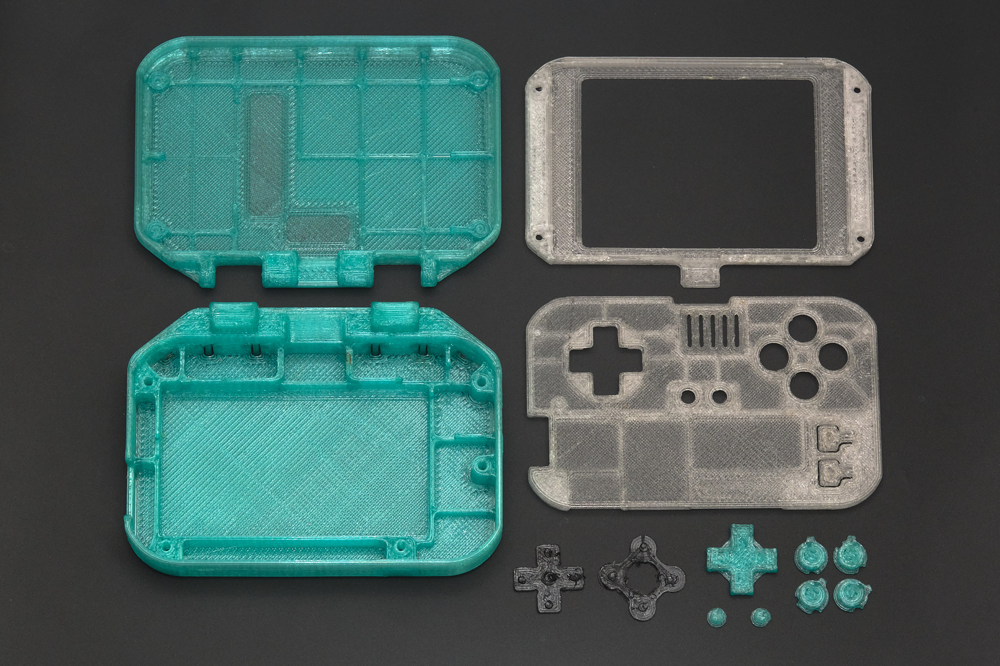

### 3D printed parts for Altoids tin version

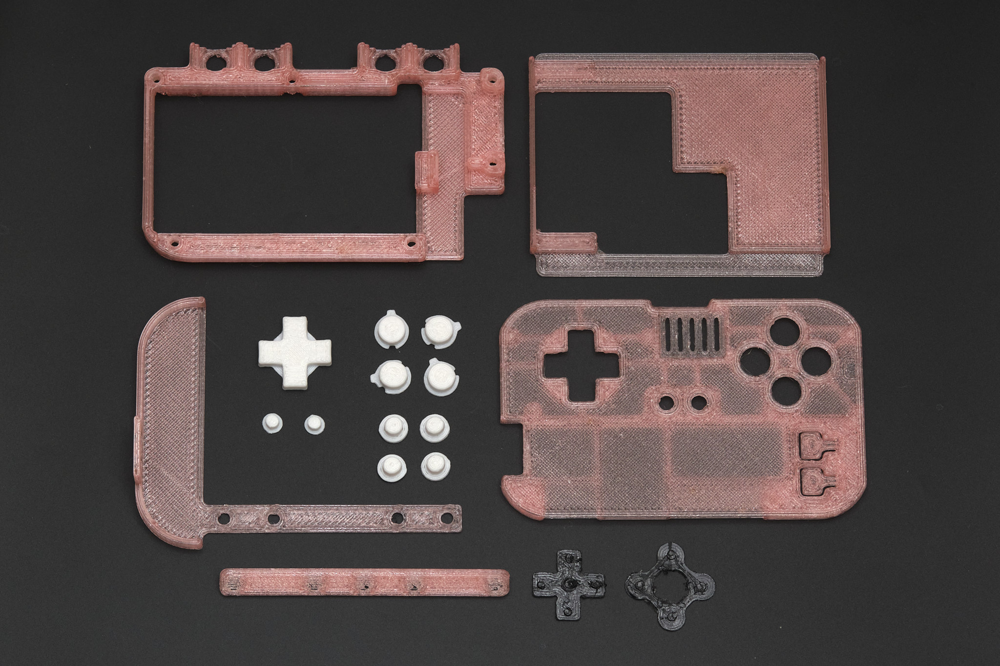

<small>All the parts shown in the photos were printed with a 0.6mm nozzle, using Bambu Lab PETG and PolyMaker PolyFlex TPU95.</small>

## note about practice boards

The latest version of the main PCB design includes two practice boards which must be broken off of the main PCB along the perforated lines. One of the boards has pads that match the Main PCB, with a second set of electrically connected pads that can be used to test continuity of the finished solder joints, and the second board has plated through holes matching the Raspberry Pi. They can be placed together as shown below and used to practice the soldering technique explained in the next section before actually soldering the Raspberry Pi to the main PCB.

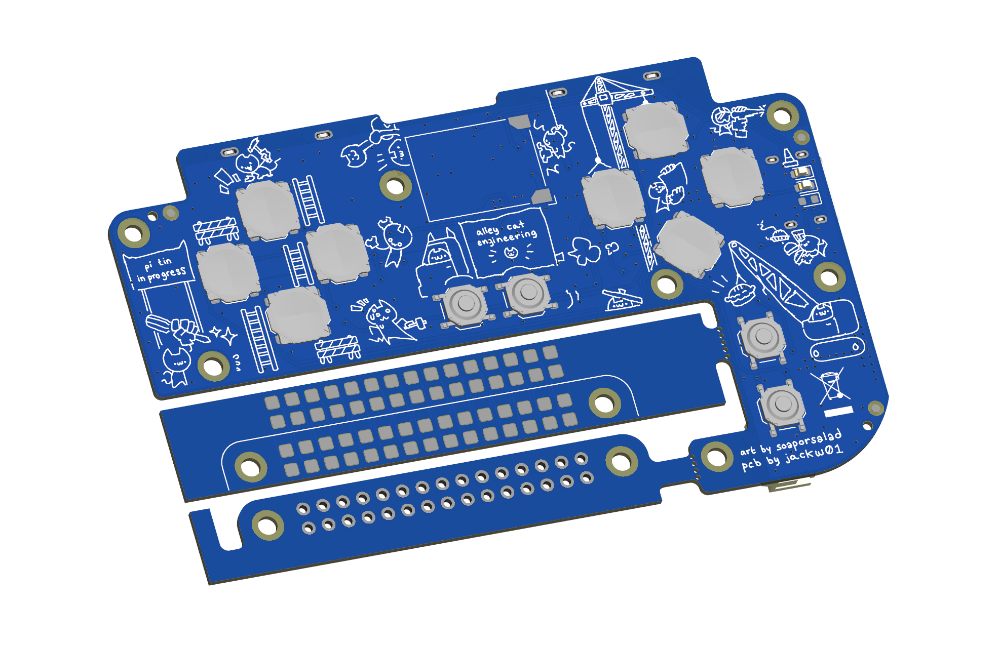

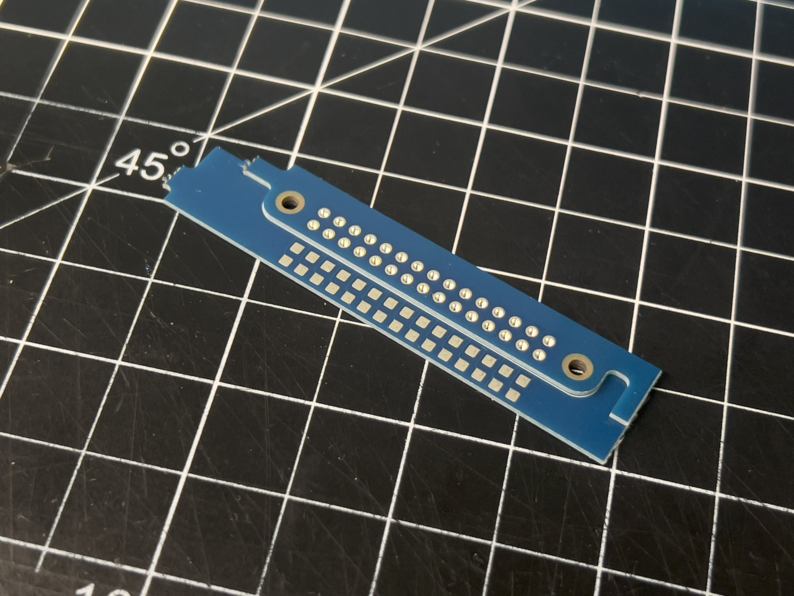

## 1. solder the Raspberry Pi to the main PCB

**Important: Use a conical or chisel type soldering iron tip that is narrow enough to fit through one of the 40-pin header holes on the Raspberry Pi. If your tip is not narrow enough, it will be very difficult to solder the boards together correctly.**

Before starting, apply a thin layer of flux to the array of 40 square pads on the Main PCB.

Place the Raspberry Pi on the Main PCB as shown, with the blank side of the Pi facing upwards. Using small spring clamps or binder clips, clamp the PCBs together at the mounting hole next to Raspberry Pi pin 2 (circled) and the opposite corner of the Raspberry Pi, keeping the Raspberry Pi aligned with the outline on the Main PCB.

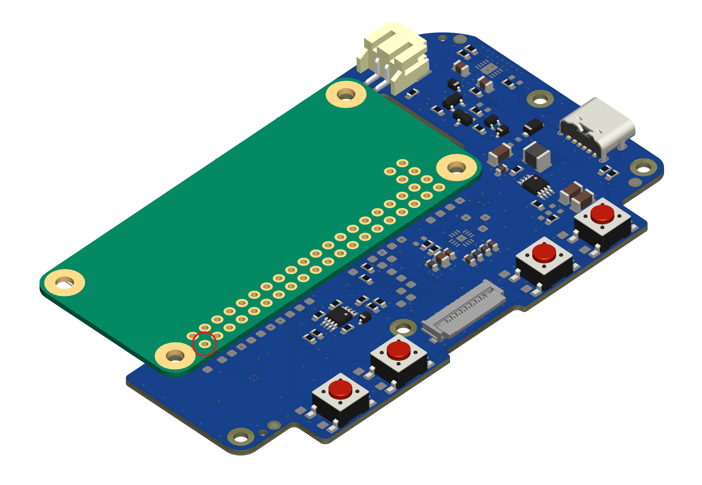

- Insert the soldering iron tip into the Pin 2 hole on the Raspberry Pi so that it makes contact with both the wall of the plated hole and the pad on the Main PCB.
- Wait 5-10 seconds for the pads to heat up, depending on the power of your soldering iron.
- Feed enough solder into the hole to partially fill it.
- Wait a few seconds for the solder to melt and stick to the walls of the hole and the pad on the Main PCB.
- Remove the soldering iron. If the solder does not form a smooth cup shape inside the hole, it is likely that it did not adhere to the pad on the Main PCB. Add some more flux and melt the solder again, holding the soldering iron in place for longer this time.

**Important: Be very careful handling the PCBs until more than a few of the Raspberry Pi pins have been soldered as it is easy to accidentally rip the pads off the Main PCB.**

Inspect the PCBs. If the Raspberry Pi is no longer aligned with the white outline on the main PCB or the two PCBs are not flush with each other where pin 2 is located, carefully reheat and reposition the solder joint. When the Pi is properly aligned, all three mounting holes should be centered and the white outline should be barely visible underneath the Pi.

**Important: The Raspberry Pi must be lined up exactly with the outline printed on the Main PCB. Otherwise, the PCB assembly may not fit correctly into the 3D printed parts. It is very difficult to correct any misalignment after more than one Raspberry Pi pad has been soldered, so it is critical to ensure that the PCBs are aligned after soldering the first pad.**

Once the first solder joint is complete, continue soldering the rest of the 40 through-hole pads on the Raspberry Pi to the Main PCB using the same steps used for Pin 2. We recommend soldering the opposite corner pad next while squeezing the PCBs together tightly to account for any warping of the PCBs, then soldering the remaining pads working from the outside of the array inwards.

**Important: The surface of the solder joints must be flush with the Raspberry Pi PCB. Any solder blobs or spikes that protrude from the surface may cause damage to the battery. Using enough flux should prevent this from being an issue.**

## 2. test the solder joints

Following the diagram below, use a multimeter to test for continuity between each test point and the corresponding pad on the Raspberry Pi to ensure the Pi is soldered correctly.

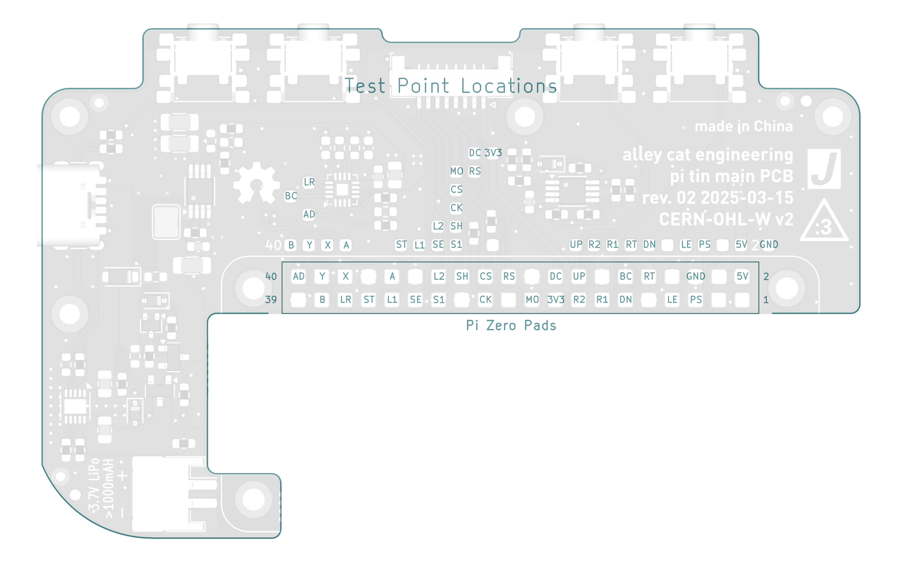

If any pads do not show continuity with their test point, add more flux to the solder joint and melt the solder again, holding the soldering iron tip inside the Raspberry Pi plated hole for at least 5 seconds.

## 3. display PCB assembly

Before inserting the display FPC (flexible printed circuit) into the connector on the Display PCB, ensure that the black retention tab on the connector (circled in the photos below) is in the open position (not pushed into the white connector housing). Insert the display FPC into the connector with the contacts facing up. It should not require any force to insert the FPC. If it does, the retention tab is likely not in the fully open position.

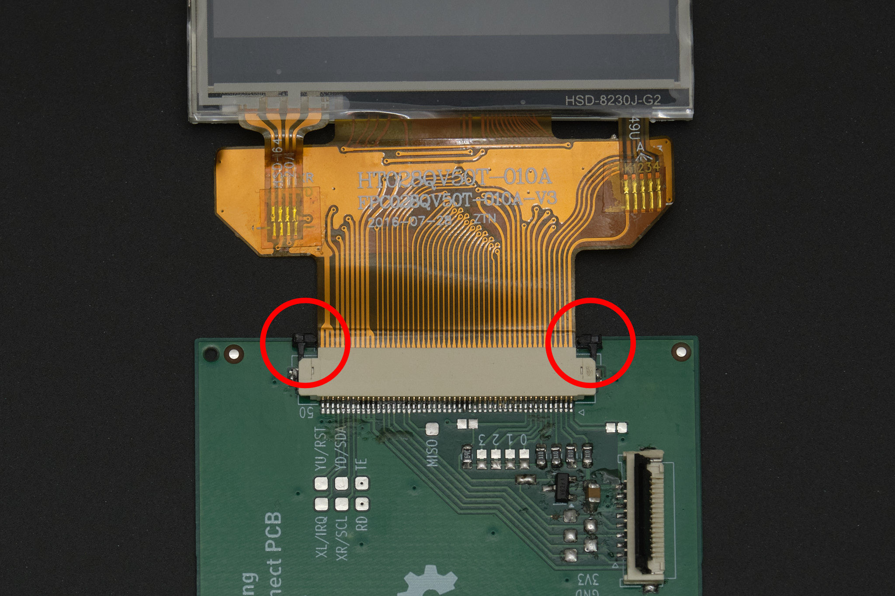

Carefully push in both sides of the retention tab at the same time until it is flush with the connector.

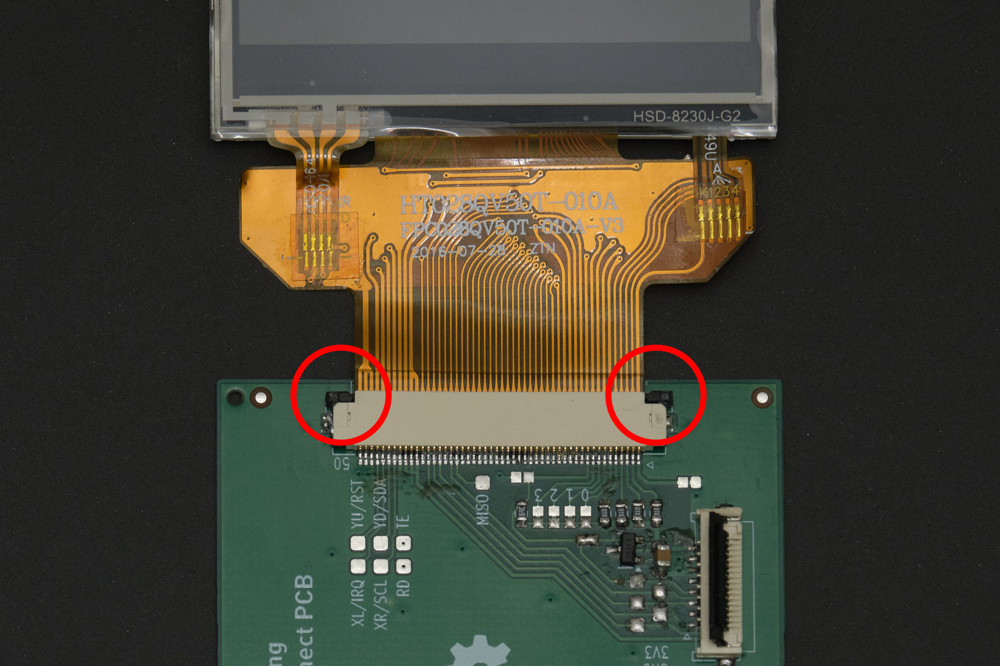

Lift up the black retention flap on the display interconnect cable connector. Insert the cable with the contacts facing down and flip down the retention flap. The cable should be held in securely.

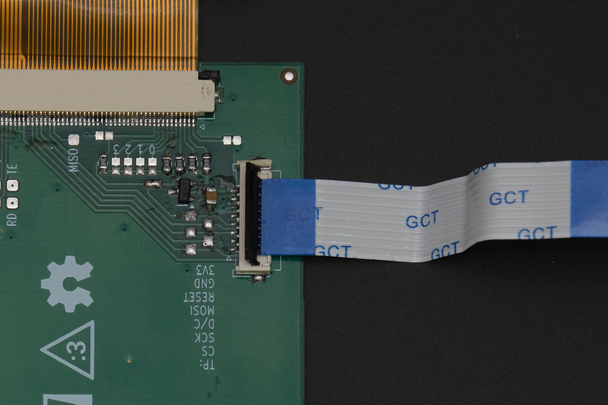

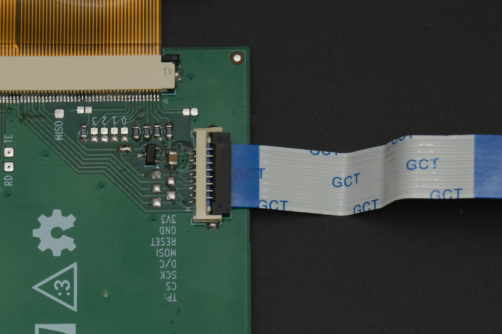

## 4. front panel assembly

Insert the buttons into the back of the front panel as shown. The A/B/X/Y buttons can only be inserted one way. The buttons should fit loosely; if using DS Lite A/B/X/Y buttons, the flanges of the buttons may need to be carefully trimmed with a craft knife or flush cutters.

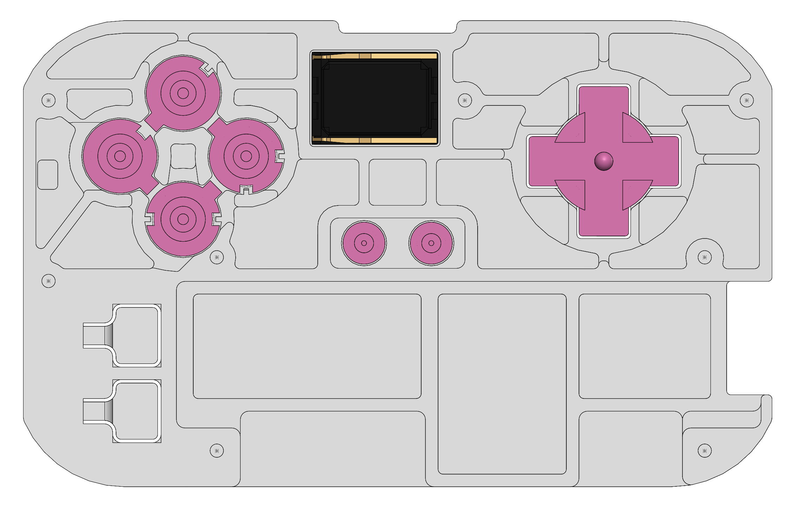

Insert the speaker into the front panel with the contacts facing upwards and to the left (away from the D-pad).

**Important: avoid touching the front surface of the speaker.**

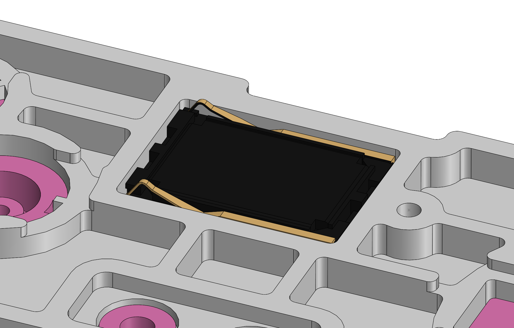

If using 3D printed buttons, place the 3D printed TPU A/B/X/Y and D-pad membranes over the buttons as shown.

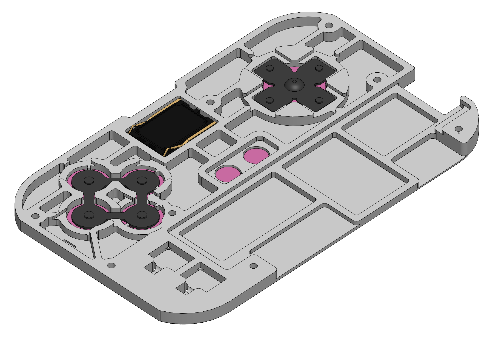

If using DS Lite buttons, insert the 3D printed TPU plugs into the A, B, X, Y, start, and select buttons and fit  the D-pad membrane over the peg at the center of the D-pad.

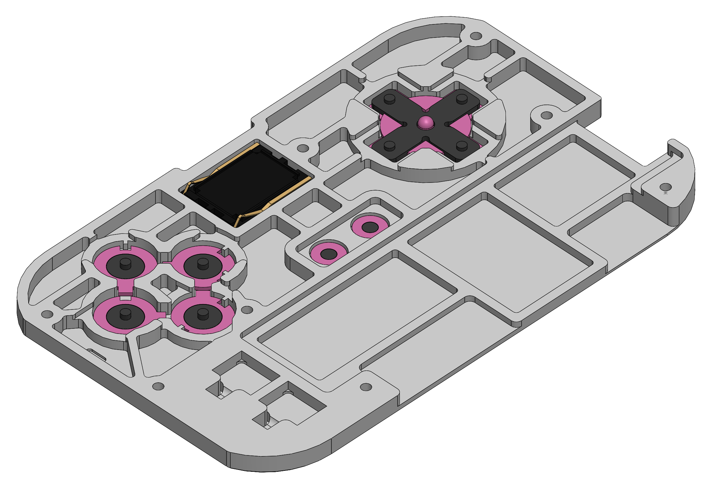

## 5. functional test

To prepare for software setup, connect the display cable to the Main PCB following the same procedure used to connect it to the Display PCB. Connect the battery to the connector at the corner of the Main PCB and ensure there is no SD card in the Raspberry Pi.

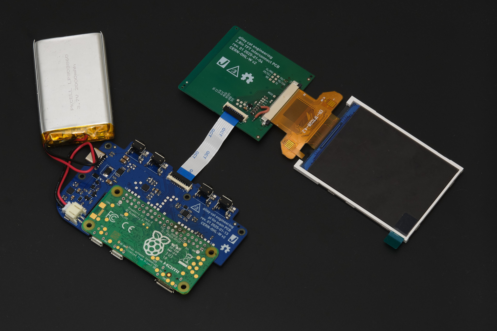

Connect the Main PCB to a power source using a USB-C cable. The green LED should illuminate to indicate that the battery is charging. If it does not, either there is something wrong with the USB-C cable or power source, or the PCB and/or battery is damaged.

*Note: The green LED indicates that the battery is charging. It turns off when the battery is fully charged. The orange LED indicates that the battery voltage is low. The Raspberry Pi will automatically shut down when the battery is critically low.*

Disconnect both the USB-C cable and the battery.

## next steps

Follow the [software setup guide](./software_setup) to install RetroPie on the Raspberry Pi and verify functionality.

Once you have installed RetroPie and verified that the hardware is working, continue to the final assembly guide for your build option.

- [final assembly - 3D printed case version](./3dp_assembly)
- [final assembly - Altoids tin version](./altoids_assembly)
