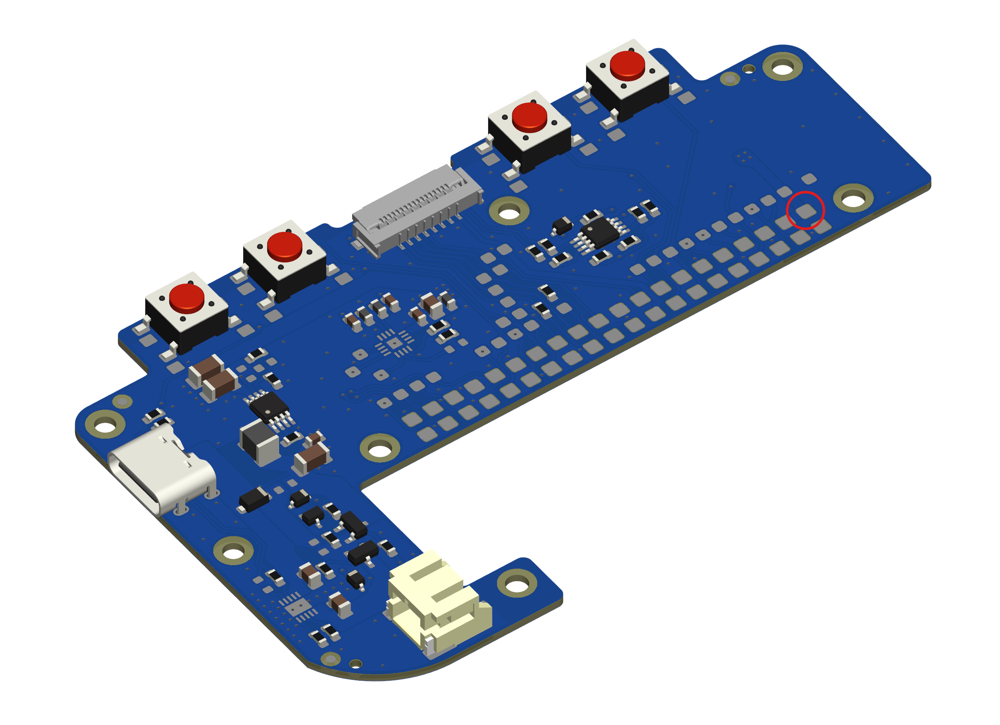

# Hardware

**Important: Read through the instructions thoroughly before building.**

## Required Parts

## Required Tools and Materials

- Soldering iron with narrow conical or chisel tip
- Solder (63% tin / 37% lead solder, 0.6mm or smaller diameter recommended)
- Flux pen or paste flux (we recommend [Chip Quik NC191](https://www.digikey.com/en/products/detail/chip-quik-inc/NC191/11480391))
- 1.5mm hex screwdriver or allen key
- Fine point tweezers

### For Altoids tin version

- Drill with 1/8in (3mm) and 3/16in (5mm) drill bits
- Needle files
- Cyanoacrylate adhesive (super glue)

## 1. solder the Raspberry Pi to the main PCB

**Important: Use a conical or chisel type soldering iron tip that is narrow enough to fit into one of the 40-pin header holes on the Raspberry Pi and protrude from the other side of the PCB.**

Before starting, apply a thin layer of flux to the array of 40 square pads on the Main PCB. Apply solder to the upper rightmost pad (circled), which will match up with pin 2 on the Raspberry Pi.

Mate the Raspberry Pi to the Main PCB as shown, with the blank side of the facing upwards. Pinch the boards together tightly, keeping the Raspberry Pi aligned with the outline on the Main PCB. Insert the soldering iron tip into the Raspberry Pi pin 2 pad (circled) and hold it there until the solder applied to the Main PCB melts and flows into the plated hole.

Inspect the PCBs. If the Raspberry Pi is no longer aligned with the white outline on the main PCB or the two PCBs are not flush with each other where pin 2 is located, carefully reheat and reposition the solder joint. **Be very careful handling the PCBs until more than a few of the Raspberry Pi pins have been soldered as it is easy to accidentally rip the pads off the Main PCB.**

Once the first solder joint is complete, continue soldering the rest of the 40 through-hole pins on the Raspberry Pi to the Main PCB. We recommend soldering the opposite corner pad next while squeezing the PCBs together to account for any warping of the PCBs, then soldering the remaining pads working from the outside of the array inwards.

For each pin:

- Insert the soldering iron tip into the hole on the Raspberry Pi so that it makes contact with both the wall of the plated hole and the pad on the Main PCB.
- Wait 5-10 seconds for the pads to heat up, depending on the power of your soldering iron.
- Feed enough solder into the hole to partially fill it.
- Wait a few seconds for the solder to melt and stick to the walls of the hole and the pad on the Main PCB.
- Remove the soldering iron. If the solder does not form a smooth cup shape inside the hole, it is likely that it did not adhere to the pad on the Main PCB. Add some more flux and melt the solder again, holding the soldering iron in place for longer this time.

## 2. test the solder joints

Use a multimeter to test for continuity between each test point and the corresponding pad on the Raspberry Pi to ensure the Pi is soldered correctly.

## 3. functional test

## 4. front panel assembly

Insert the buttons into the back of the front panel as shown. The A/B/X/Y buttons can only be inserted one way. The buttons should fit loosely; if using DS Lite A/B/X/Y buttons, the flanges of the buttons may need to be carefully trimmed with a craft knife or flush cutters.

Insert the speaker into the front panel with the contacts facing upwards and to the left (away from the D-pad).

If using DS Lite buttons, insert the 3D printed TPU plugs into the A, B, X, Y, start, and select buttons and fit  the D-pad membrane over the peg at the center of the D-pad.

If using 3D printed buttons, place the 3D printed TPU A/B/X/Y and D-pad membranes over the buttons as shown.

