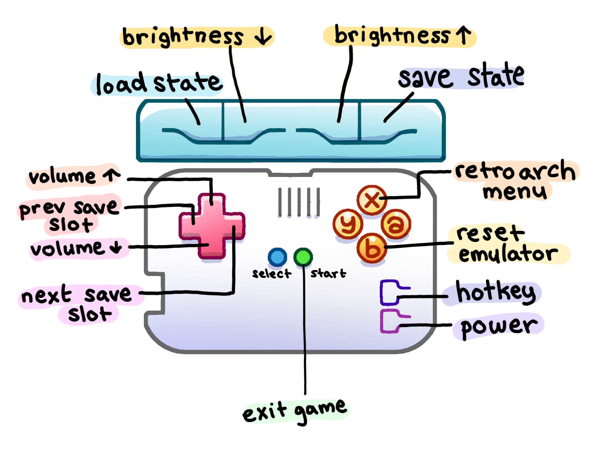

# Pi Tin Software Setup

For convenience, we provide a SD card image based on [RetroPie 4.8](https://retropie.org.uk/download/) with all required software installed and configured. This guide assumes you are using the prebuilt image. If not, full instructions for installing the required software on top of a clean install of RetroPie are [here](./full_software_setup.md).

## 1. install the prebuilt image

Download the Pi Tin prebuilt image [here (2GB zip file)](https://github.com/jackw01/pi-tin/releases/download/v1.1/pi_tin_20250617.zip). Unzip and write the image to a 8GB or larger MicroSD card using [Win32DiskImager](https://sourceforge.net/projects/win32diskimager/), [Raspberry Pi Imager](https://www.raspberrypi.com/software/), or [Etcher](https://etcher.balena.io/).

## 2. set up wifi

After writing the SD card, eject and reinsert it to access the newly created boot partition.

*Note: If using Windows, ignore any popups asking to "scan and fix" or format the SD card.*

Create a file called `wpa_supplicant.conf` in the root directory of the boot partition with the contents below, replacing `SSID` and `PASSWORD` with your network name and password. You can add multiple networks by copying the `network={}` block. If you are outside of the United States, change `country=US` to your country's [ISO two-letter country code](https://en.wikipedia.org/wiki/List_of_ISO_3166_country_codes).

```conf
country=US
ctrl_interface=DIR=/var/run/wpa_supplicant GROUP=netdev
update_config=1

# RETROPIE CONFIG START
network={
    ssid="SSID"
    psk="PASSWORD"
}
# RETROPIE CONFIG END
```

Eject the SD card.

## 3. boot Raspberry Pi and verify functionality

With the display connected, insert the SD card, connect the USB-C cable, and press the power button to power up the Raspberry Pi. If the hardware build and software installation were done correctly, the display should show a black screen at power on, then within 1 minute display the RetroPie splash screen and the EmulationStation launcher. Hold the power button for about half a second and release it. The Raspberry Pi should safely shut down and the display should turn off completely. If the Raspberry Pi does not shut down, it is likely because one or more of the pads is not soldered properly.

## 4. connect via SSH and change password

The Raspberry Pi should automatically connect to your WiFi network within a minute after booting up and you should be able to log in via SSH using the default password `raspberry` (use `ssh pi@retropie.local` in the command line on any computer running Windows 10 or 11, Mac OS, or Linux).

We strongly recommend changing the user password since SSH and SMB are enabled. This can be done by running the `passwd` command on the Raspberry Pi via SSH.

You can also test audio at this point by running `speaker-test -c2` on the Raspberry Pi. You should hear white noise from the speaker.

## 5. using RetroPie

Follow the [RetroPie Getting Started guide](https://retropie.org.uk/docs/Controller-Configuration/) to configure and test the gamepad buttons and load ROMs.

Pi Tin has a dedicated hotkey for RetroPie which is located directly above the power button. **This button should be selected as "Hotkey Enable" during the controller setup process.** The special functions shown below can be used by pressing the buttons while holding down the hotkey.



### configure volume control

The volume control hotkeys must be set up after configuring the controller by manually editing the  configuration file. Log in via SSH and run `sudo nano "/opt/retropie/configs/all/retroarch/autoconfig/GPIOnext Joypad 1.cfg"`. Add these lines at the end of the file to enable volume control using the hotkey and press `Ctrl+X`, then `Y`, then `Enter` to save.

```conf
input_volume_up_axis = "-1"
input_volume_down_axis = "+1"
```

## next steps

Once you have installed and configured RetroPie and verified that the hardware is working, continue to the final assembly guide for your build option.

- [final assembly - 3D printed case version](./3dp_assembly.md)
- [final assembly - Altoids tin version](./altoids_assembly.md)
